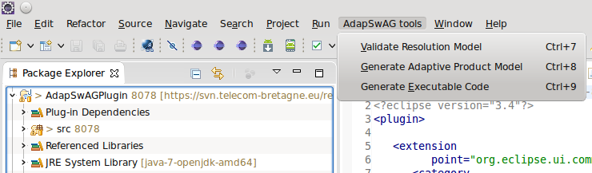
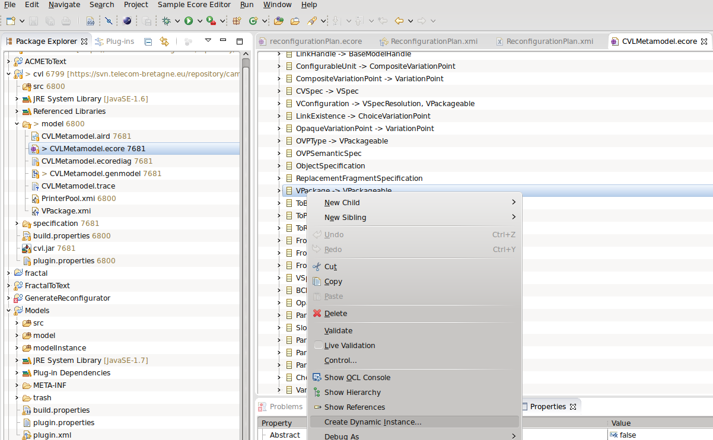
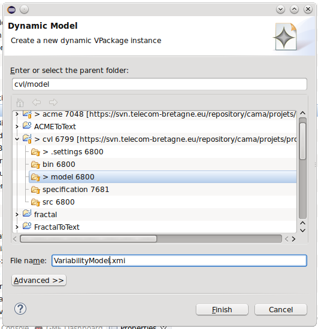
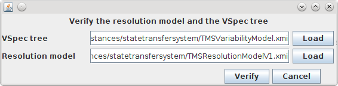
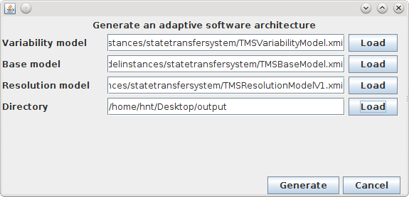
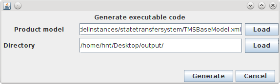

AdapSwAGPlugin - an Eclipse plugin for generating adaptive product models from models specified in CVL
====================================================================================================

<h1>1. Introduction </h1>
The purpose we create this plugin is to validate the resolution model, generate the adaptive product architecture, and the executable code from models specified in CVL. These CVL models have been extended with a new attribute, "availabilityAtRuntime", added in the CVL meta-model.

The plugin' name is called Adaptive Software Architecture Generation(AdapSwAG) tool. It consists of three modules to validate the resolution model, generate the
adaptive product model from the models specified in the domain engineering,
and executable code from the adaptive product model. These modules are integrated into the Eclipse platform as new menu entities



<h1>2. Installation</h1>
In order to install the plugin, it is simple to copy the jar file in the "plugin" directory of the project into the plugin directory of the Eclipse folder. 
</br>
Example: 

```
cp /plugin/AdapSwAGPlugin_1.0.0.201707091449.jar eclipse/plugins/
```
Finally, restart Eclipse
</br>
We tested this plugin with Eclipse Luna 4.4.2.

<h1>3. Utilisation</h1>
In order to use this tool, you should have three models: the variability model, the resolution model, and the base model. The first version of this tool support the base model specified only with ACME metamodel.

<h2> 3.1. Specifying CVL model and base model using EMF Editor </h2>
<h3> Specifying the variability model and the resolution model by using CVL metamodel </h3>
The extended CVL metamodel is placed in the metamodel directory. You can reuse this model to create your variability models from Eclipse EMF Editor.



You search the class VPackage in the metamodel, right click on it, and select Create Dynamic Instance. A new window allows you to set the file name of the variability model and its directory.  



You open the file with Simple Reflective Ecore Model Editor. This editor allows you to create elements in the variability model such as VSpecs, VariationPoints, Constraints.

Similar to the specification of the variability model, the resolution model is created as well, but elements specified in the resolution model are VSpecResolutions. 

<h3>Specifying the base model using ACME metamodel</h3>
In the metamodel directory, we provide an ACME metamodel that is used to create the base model.
The root element in the base model is System that contains Component and Connector (Binding, Attachment).

<h2>3.2. Validating the resolution model </h2> 
The first menu item in the AdapSaWG tools allows openning a window for verifying a resolution model conforming to a variability model. 
</br>
Here, we provide a simple interface that allows to point two file of the variability model and its the corresponding resolution one.
</br>
The results of the validation activity is a message that indicates where conflicts need to be corrected.



Some error messages could arise when validating the conformity of the resolution model with the variability model. The tool can detect the errors in the resolution model as follows:
```
"The VSpecResolution root is not selected "
```
```
"Error: Conflict with impliedByParent constraint in <VSpecResolution>"
```
```
"Error: Conflict with multiplicity constraint in <VSpecResolution>"
```
```
"Error: Conflict with implies constraint in <VSpecResolution>"
```
```
"Error: Conflict with excludes constraint in <VSpecResolution>"
```

<h2>3.3. Generating adaptive product model </h2> 
In order to generate the adaptive product model from the models specified from the design time, you select the second submenu in the AdapSwAG tool menu. A new windows allows you to input the CVL files (the variability, the base and the resolution models). The directory textbox allows to identify the location the generated file (the product model) stored.



<h2>3.4. Generating partially executable code </h2> 
In order to generate partially the executable code, the text generation is used. It uses the generated product model in the privious section as its input. The location where generated code is placed is indicated in the directory textbox.




<h1>4. Example</h1>

In the directory Example, we provide two test collections to vefiry how to the plugin performs. 


